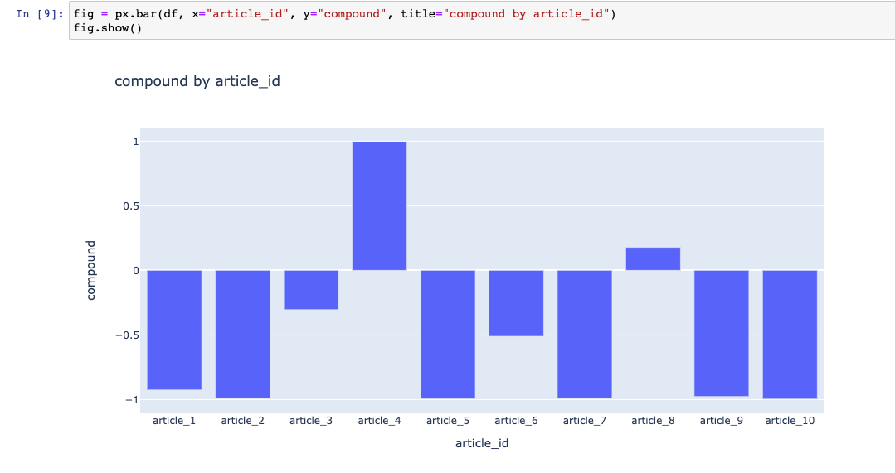

# Sentiment Analysis

## Environment
I used Jupyter Notebook as my main editor. My python version is 3.8+

## Steps and Methodologies
There are four main steps I implemented for this project.

**1. Data Collection**: In this step I used beautifulSoup package to perform data scraping from each article in https://www.aljazeera.com/where/mozambique/

I scraped each article and stored the data in a JSON file (data.json), an example the JSON format I used is below:

```JSON
{article_id: "article_1"
    {
     title: "title1"
     description: "description1"
     article: "article1"
    }
}
```

basically, I only stored title, description and the actual news article for out sentiment analysis and classified each article into article_ids.
I was able to do that because of the BeautifulSoup package allowed me to find and extract the class_id in the HTML file that this website uses to identify the article.

**2. Data Preprocessing**: I did not have to do much work since I excluded unrelated part of the article out in the scraping step, but I did cleaned up some extra HTML tags that came along in the scraping steps.


**3. Compute Sentiment using Vader**: 
I chose Vader since it is a pre-trained sentiment analysis algorithm that is easy to implement, and the result is clear and easy to interpret.
In this file (sentiment.py) I read the JSON file from step 1 and 2, then formatted and plugged it into Vader algorithm.

```python3
#sentiment.py
import json
import pandas as pd
import nltk
from nltk.sentiment.vader import SentimentIntensityAnalyzer
nltk.download('vader_lexicon')
import plotly.express as px

df = pd.DataFrame(columns=['neg', 'neu','pos','compound','article_id'])
for key, value in json_object.items():
    sentiment = vader.polarity_scores(json_object[key]['article'])
    print(key, '->', value['title'])
    sentiment['article_id'] = key
    print(key, '->', sentiment)
    df1 = pd.DataFrame([sentiment], columns=['neg', 'neu','pos','compound','article_id'])
    df = pd.concat([df,df1])
    
sentiment = []
for row in df['compound']:
    if row <= -0.05 :    sentiment.append('negative')
    elif row > -0.05 and row < 0.05:   sentiment.append('neutral')
    elif row >= 0.05:  sentiment.append('positive')
    else:  sentiment.append('Not_Rated')

df['sentiment'] = sentiment
```

**4. Visualization and Result**:
I used plotly library to visualize the result I got from Vader algorithm.
Out of 10 most recent articles, 8 of them have negative sentiment and 2 of them have positive sentiment according to Vader.



One of the article that got positive sentiment is an article titled "Analysis: Can African gas replace Russian supplies to Europe?" (https://www.aljazeera.com/economy/2022/3/1/analysis-can-african-gas-replace-russian-supplies-to-europe).
This article presents both side of the story and contain both positive and negative words. However, most of the recent articles reported, mostly, disasters, deaths, attacks which contain so many negative words in the article. That is why 8 out of 10 articles got negative sentiment overall.

Note: As a next step, I would like to try other algorithms and alterations of the input to find more accurate results.

## How to run the code

There are two python file to be run.

1. Scraper.py: This file will perform data collection and data preprocessing. The output will be a JSON file which will be an input for the second python file.
2. sentiment.py: This file will perform the sentimental analysis and visualization. The file will take JSON as an input and create dataframe and graph as an output.

Run time: Total: 2.39 seconds

Scraper.py: 1.85 second

sentiment.py: 0.34 second


